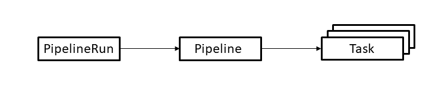
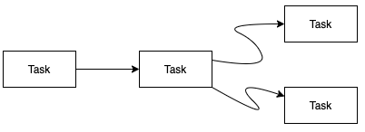

Execute Tekton-Pipeline with Workspaces on Openshift:

Tekton provides a set of extensions to Kubernetes, in the form of Custom Resources, for defining pipelines.

The resources are used as follows:

* A PipelineRun defines an execution of a pipeline. It references the pipeline to run.
* A pipeline defines the set of Tasks that compose a pipeline.

* A Task defines a set of build steps, such as compiling code, running tests, and building and deploying images.

Tekton Worspaces provide a way for sharing the dependency jar files between Task runs.
Also Tekton workspaces can speed up the build phase as the dependencies are cached on the Workspace.

create a simple pipeline that:
* Builds a Docker image from source files and pushes it to your private container registry
* Deploys the image to your openshift cluster
* The example we are using first builds and installs a dependency library to the local repo and then it builds the application which needed the library

Clone the repository:
You should clone this project to your workstation

git clone https://github.com/gudipatinrao/tekton-tutorial.git

1)Create a Task to clone the Git repository:

The Task requires a workspace where the clone is stored. From the point of view of the Task, a workspace provides a file system path where it can read or write data.
Steps can reference the path using the syntax $(workspaces.name.path) where name is the name of the workspace.
The workspace becomes associated with a storage volume.
The lib and app are cloned to libsrc,appsrc subdirectories respectively

Now apply the file to your cluster to create the Task:

Oc apply -f  git-clone.yaml

2)Next step is to build the libray and application which are cloned to the Workspace.

we are using a maven task for accomplishing this , we provide the workspaces.source.path as the localrepo for maven task to install the
built artifacts to local repo

3)Next step is to create a Task to build an image and push it to a container registry

The Tekton Catalog provides a Buildah Task which does this.

This Task needs a workspace . This workspace has the source to build and the pipeline provides the same workspace that it used for the git-clone Task.
The Buildah  Task also uses a feature called results. A result is a value produced by a Task which can then be used as a parameter value to other Tasks.
This Task declares a result named IMAGE-DIGEST which it sets to the digest of the built image.
 A Task sets a result by writing it to a file named /tekton/results/name where name is the name of the result (in this case IMAGE-DIGEST).

Now apply the file to your cluster to create the Task:

Oc apply -f buildah.yaml

4)Create a Task to deploy an image to a Openshift cluster
The final function that the pipeline needs is a Task that deploys a Docker image to a Openshift cluster.

This Task has two steps.
* The first step runs sed to update the YAML file used for deployment with the image that was built by the buildahTask. This step requires the YAML file to have two character strings, __IMAGE__ and __DIGEST__, which are substituted with parameter values.
* The second step  apply the YAML file to the cluster where the pipeline is running.

Now apply the file to your cluster to create the Task:

Oc apply -f tekton/tasks/deploy-using-kubectl.yaml

5)Create a pipeline:

pipeline resource contains a list of Tasks to run. here they are clone-repo, source-to-image, and deploy-using-kubectl.

Now apply the file to your cluster to create the pipeline:

oc apply -f tekton/pipeline/build-and-deploy-pipeline.yaml

6)Define a ServiceAccount:
The OpenShift Pipelines Operator adds and configures a Serviceaccount named pipeline that has sufficient permissions to build and push an image. This ServiceAccount is used by pipelineruns.
Run the following command to see the pipeline service account:
oc get serviceaccount pipeline

Before running the pipeline, you need to set up a service account so that it can access protected resources.

First, you need to enable programmatic access to your private container registry by creating an IBM Cloud Identity and Access Management (IAM) API key. See the IBM Cloud Documentation for automating access to the IBM Cloud Container Registry to learn how to create a user API key.

After you have the API key, you can create the following secret:

oc create secret docker-registry icr-registry --docker-server=us.icr.io --docker-username=iamapikey --docker-password=<apikey>

Here the docker server is the domain name of the registry you can find out the domain name of your registry using the command ibmcloud cr region

Link the secrets to the Service account pipeline

oc secret link default icr-registry
oc secret link default icr-registry --for=pull
oc secret link pipeline icr-registry
oc secret link pipeline icr-registry --for=pull

7)Create a PipelineRun:

Before you run the pipeline for the first time, you must create the persistent volume claim for the workspace:

oc create -f tekton/tekton-ws-pvc.yaml

The persistent volume claim requests Kubernetes to obtain a storage volume. Since each PipelineRun references the same claim and thus the same volume, the PipelineRun can only be run consecutively to avoid conflicting use of the volume

Before continuing, check to see that the persistent volume claim is bound:

Run the pipeline:

Oc create -f tekton/run/tekton-ws-pipeline-run.yaml

8)We can view the contents of the PVC using the utility inside tasks

oc create -f tekton/tasks/listpvc.yaml

this creates a deployment that uses above PVC to mount it as a volume into /tmp/persistent:

Now we want to test if data in the volume actually persists. For this we find the pod managed by above deployment, exec into its main container and create a file called data in the /tmp/persistent directory (where we decided to mount the PV):

oc get po

kubectl exec -it pv-deploy-69959dccb5-xxxx -- bash
